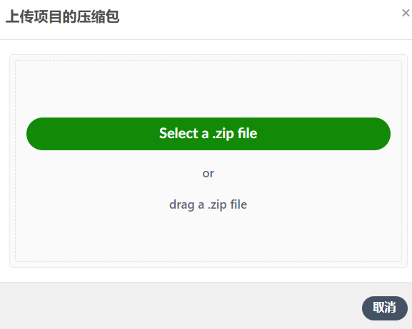

# 广东工业大学幻灯片模板
## 使用说明
1. 推荐使用overleaf；
2. 本地latex运行：下载本模板文件；
3. 编写 ```.tex``` 文件；
4. 使用 ```XeLaTeX``` 编译（当前仅支持 ```XeLaTeX``` 方式编译）。

### Overleaf使用教程：

1. 下载该源码到本地


2. 将其导入到Overleaf(也可以先fork到自己的github中，然后从github中导入)


3. 选择下载的压缩文件




4. 选择```XeLaTeX``` 编译即可


## 截图展示


## 更新日志
* 2020-12-12 :
  * v1.0 
    * 第一版发布在 GitHub 上
    * 将模板引用的资源文件（例如学校 logo 等）归类到 ```res``` 文件夹之下
    * 添加截图展示
* 2023-09-18 ：
  * v2.0
    * 背景改为红色 
    * 写明详细的Overleaf打开步骤 